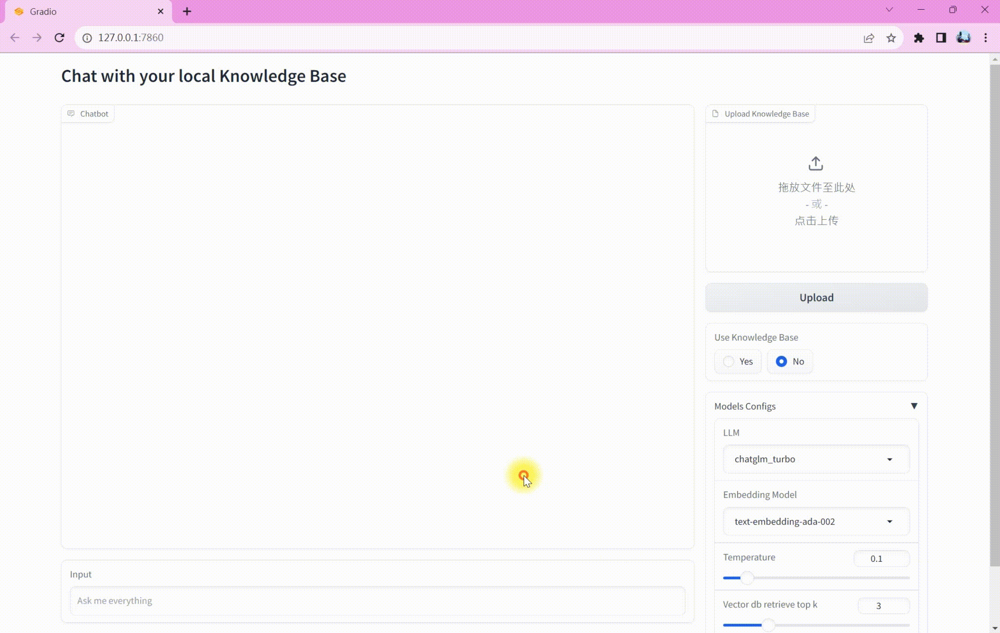

# 基于 LangChain 知识库对话 Demo

> 🐦 麻雀虽小五脏俱全。尽量最寻模块化、标准化的方式组织整个项目结构，以便于在此基础上拓展。
> 可以使用 `OpenAI` (ChatGPT), `Qianfan` (文心一言）, `ZhipuAI` (ChatGLM) 的
> LLM 和 Embedding 模型。当然你也可以参考 [LangChain](https://github.com/langchain-ai/langchain) 
> 的封装规范继续添加其他模型。项目还使用了 [Chroma](https://docs.trychroma.com/getting-started) 作为向量数据库
> 并借助 [Gradio](https://www.gradio.app/) 实现 WebUI。这是一个简单的项目，它的贡献点在于提供了一个简单易上手的基于
> LangChain 使用 LLM + 知识库 的 QA 系统框架，高解耦性支持你在此基础上做更多的拓展和二次开发。

作为学习大模型应用开发的第一个项目，较多的参考了 [llm-universe](https://github.com/datawhalechina/llm-universe/tree/main)
和 [Langchain-Chatchat](https://github.com/chatchat-space/Langchain-Chatchat) 项目实现方式。
向两个项目的作者 ([Datawhale](https://github.com/datawhalechina), [
Chatchat-Space](https://github.com/chatchat-space)) 深表感谢，开源为每一个 Programmer 都带来了极大的便利。

## 🖼️ 演示

### 不使用知识库



### 使用知识库


## 🆕 特性

- **丝滑切换 LLM 🤖**：遵循一定的标准化封装方式，**即使是在对话期间切换大语言模型依然能保持先前的记忆，继续对话**。
- **支持多种类型文件 📄**： 可以读取文本、ppt、html、pdf、图片等多种格式文件。
- **易拓展 🪆**：基于 LangChain 的 ChatModel 封装，可以轻松拓展到其他模型。
- **用户友好 🙆**：借助 Gradio 实现了易于使用的 WebUI。

## 📐 基本原理

1. `loading`：LangChain 集成了多种文档加载方式，这里使用的是 [Unstructured File](https://python.langchain.com/docs/integrations/document_loaders/unstructured_file)。
2. `Splitting`：这里使用 [`RecursiveCharacterTextSplitter`](https://python.langchain.com/docs/modules/data_connection/document_transformers/text_splitters/recursive_text_splitter) 分割文本。
3. `Storage`：将分割的文本向量化，并存储到向量数据库。
4. `Retrieval`：根据用户输入的问题，检索相关的文档。
5. `Generation`：设计 Prompt 模板，组合召回的文档和问题，并结合 ChatModel 构造 [Chain](https://python.langchain.com/docs/modules/chains/) （这里使用了 LangChain 的 [LCEL](https://python.langchain.com/docs/expression_language/)），通过运行 Chain 得到回答。


## 💻 安装

### 1. 配置环境

```shell
# 拉取仓库
git clone https://github.com/hsushuai/LangChain-Chat-Demo.git

# 进入目录
cd LangChain-Chat-Demo

# 创建 Conda 环境
conda create -n langchain-chat-demo python=3.10 -y
conda activate langchain-chat-demo

# 安装依赖包
pip install -r requirements.txt
```

### 2. 设置 API key

将你的 API key 添加到环境中。你可以在终端中添加，或直接在项目的 `.env` 文件中设置。

- **在终端中设置**

这里以 `OPENAI-API-KEY` 为例，你需要将 `<your api key>` 替换为你自己的 API key

Windows PowerShell:

```shell
$Env:OPENAI-API-KEY="<your api key>"
```
  
Windows Command:
  
```
set OPENAI-API-KEY=<your api key>
```

Linux/MacOS
    
```shell
export OPEN-API-KEY="<your api key>"
```

- **在 `.env` 中设置**

或者使用记事本打开 `.env` 文件，设置对应的 API key 就可以了

### 3. 启动 WebUI

运行命令

```shell
python webui.py
```

在浏览器中打开 http://127.0.0.1:7860/ 即可。

另外，你可以在 ``

## 🙌 贡献

如果你发现项目有任何问题或者值得改进的地方，欢迎你提交 Issue 或者 PR。

当然我也期待着你的 Start ✨。
